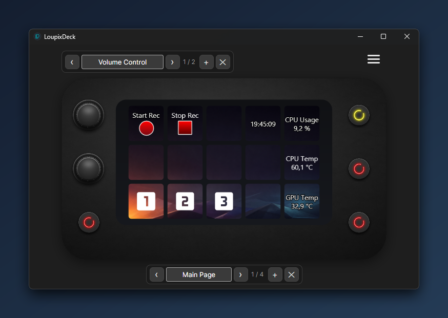
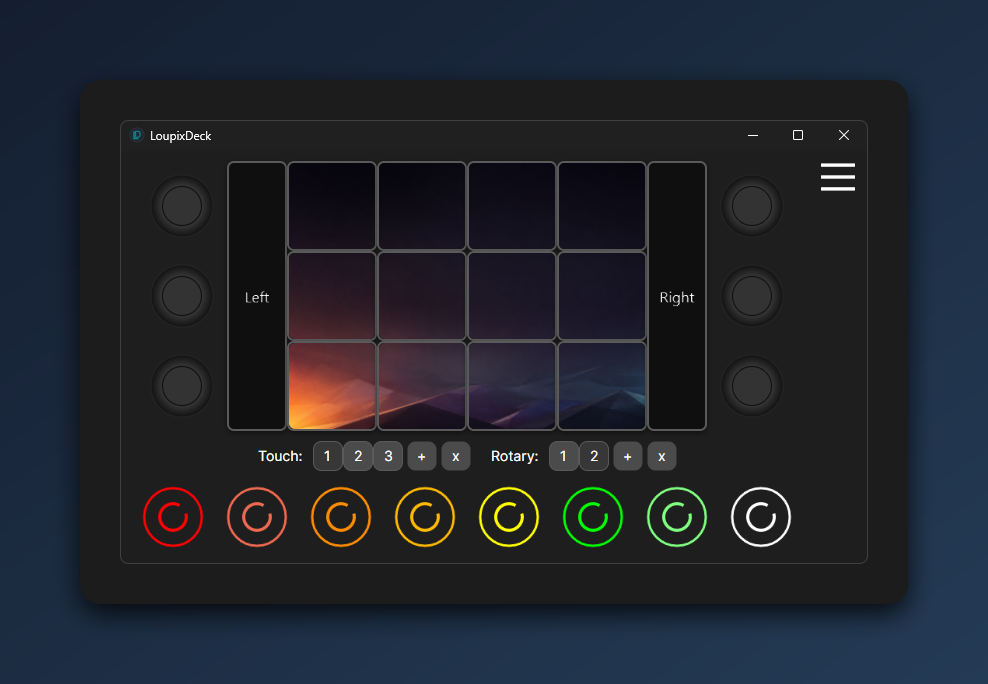
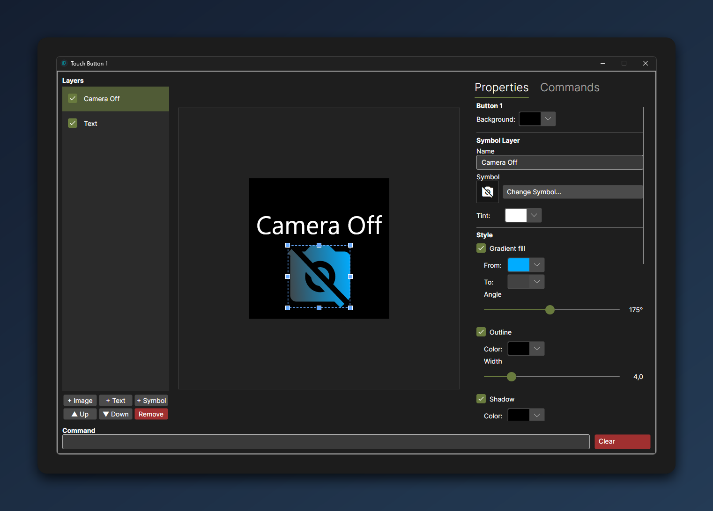
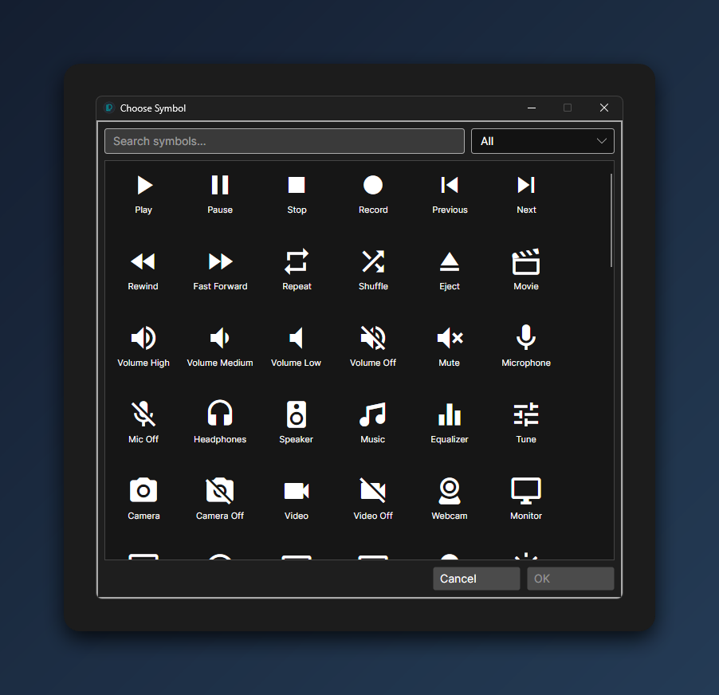
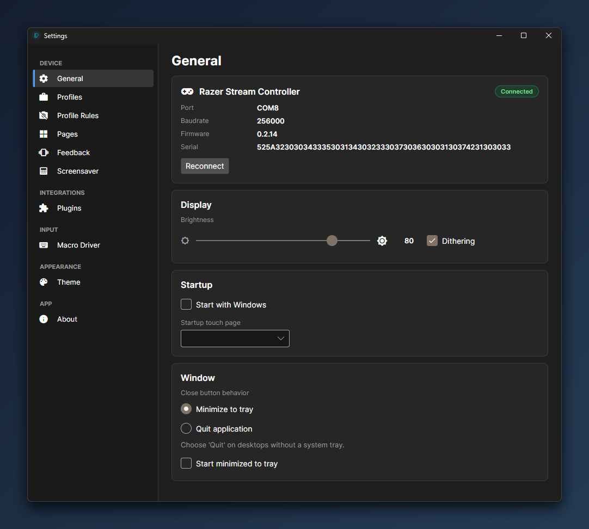
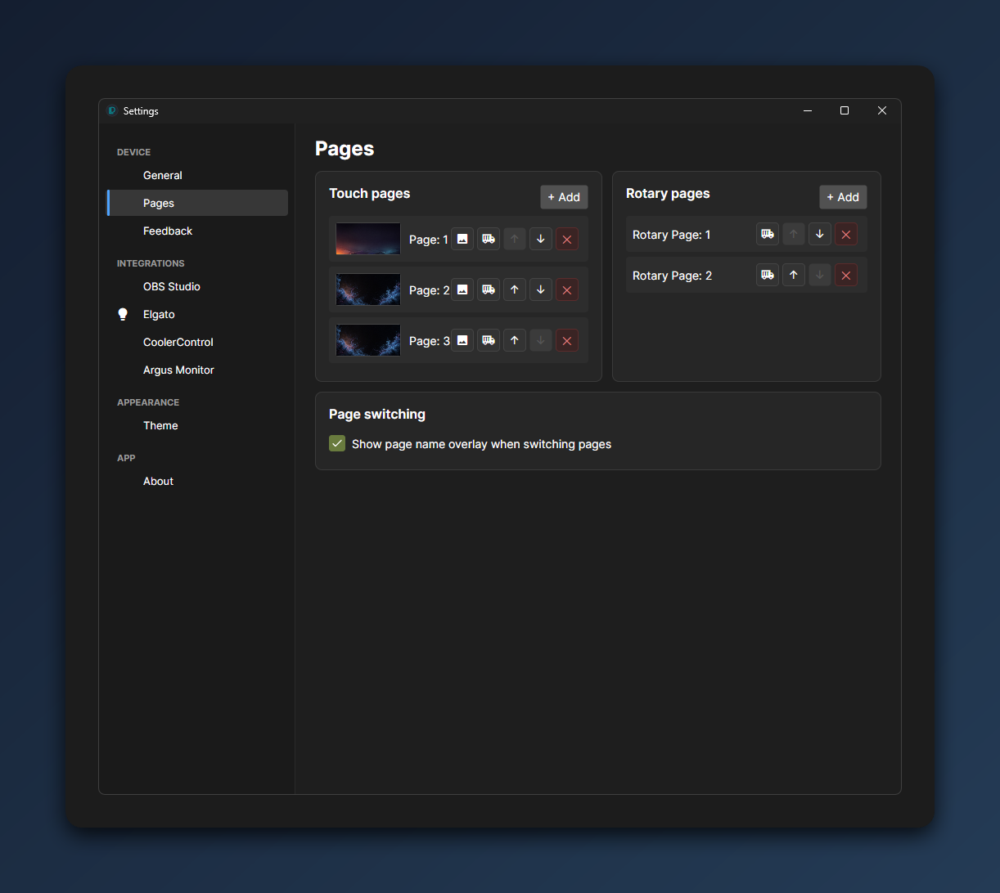
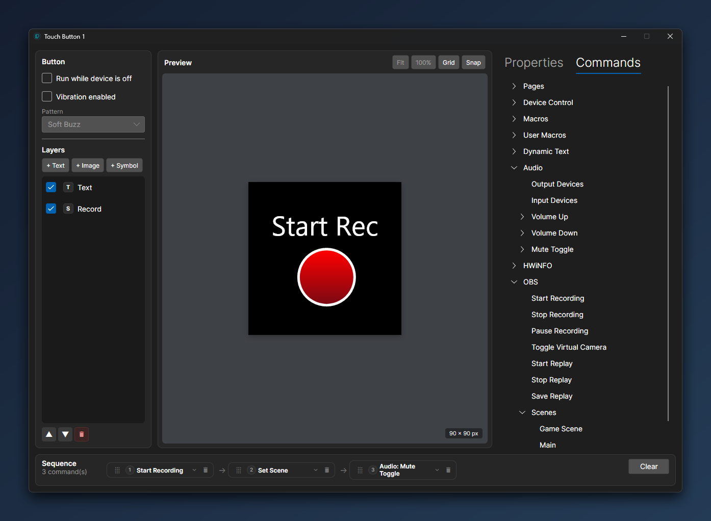

# LoupixDeck

[](https://github.com/RadiatorTwo/LoupixDeck/actions/workflows/release.yml)
[](https://github.com/RadiatorTwo/LoupixDeck)
[](https://github.com/RadiatorTwo/LoupixDeck)
[](LICENSE)

**LoupixDeck** is a Cross-platform (Linux/Windows) GUI application — open-source alternative to Loupedeck software for Loupedeck Live S and Razer Stream Controller.

Built with Avalonia and .NET 9, it provides a fully customizable interface to design
multi-layered touch buttons, assign commands, drive external tools (OBS, Elgato, Cooler Control,
Argus Monitor, …) and manage dynamic page layouts for both touchscreen and rotary inputs.

---

## ⚠️ Disclaimer

LoupixDeck is experimental but actively developed. Features evolve quickly between releases; expect
the occasional rough edge. Bug reports and PRs are welcome.

---

## 🚀 Quick Install (Linux)

Distro-agnostic one-liner — downloads the latest release binary, installs it system-wide,
sets up udev rules and a desktop entry, and installs the .NET 9 runtime if it's missing.
Works on Arch/CachyOS/Manjaro, Debian/Ubuntu/Mint/Pop!_OS, Fedora/RHEL, openSUSE,
Alpine, Void, Gentoo, Solus (anything with one of the common package managers; falls
back to Microsoft's `dotnet-install.sh` otherwise).

```bash
curl -fsSL https://raw.githubusercontent.com/RadiatorTwo/LoupixDeck/master/install-loupixdeck.sh | bash
```

Or with `wget`:

```bash
wget -qO- https://raw.githubusercontent.com/RadiatorTwo/LoupixDeck/master/install-loupixdeck.sh | bash
```

Prefer to inspect first:

```bash
curl -fsSLO https://raw.githubusercontent.com/RadiatorTwo/LoupixDeck/master/install-loupixdeck.sh
less install-loupixdeck.sh
bash install-loupixdeck.sh
```

After install, launch with `loupixdeck` or from your application menu.

---

## 🖥️ Supported Devices

| Device | VID:PID | Layout |
|---|---|---|
| **Loupedeck Live S** | `2ec2:0006` | 5×3 touch grid, 2 rotary encoders, 8 physical buttons |
| **Razer Stream Controller** | `1532:0d06` | 4×3 touch grid, 2 side panels, 6 rotary encoders, 8 LED buttons |

Only one device is driven per app session. Each supported model keeps its own persisted
configuration (`config_loupedeck-live-s.json`, `config_razer-stream-controller.json`, …),
so switching the connected hardware and restarting the app picks up the matching layout
automatically. See [`Registry/DeviceRegistry.cs`](Registry/DeviceRegistry.cs).

---

## ✨ Features

### Touch Buttons
- **Layer-based editor** — stack image, text, and symbol layers per button.
- **Live 600×600 preview** with direct manipulation: drag layers, resize via corner handles,
  hold `Shift` to unlock aspect ratio, hold `Alt` to crop instead of scale.
- **Per-page wallpaper** — each touch page can have its own tiled background image with
  independent opacity control.
- **Visual touch feedback** — optional colored, translucent flash overlay on the pressed
  slot; color and opacity are configurable in the settings.
- **Touch-sliding prevention** — when enabled (default), sliding a finger across the
  touchscreen will not trigger neighbouring buttons; toggleable in the settings.
- **Content-addressed asset store** — image assets are deduplicated automatically.

### Symbol Picker
- Searchable browser for the bundled **Material Design Icons** font.
- Assign any glyph to a symbol layer with custom color, size, and position.

### Rotary Encoders
- Independent rotary pages with per-rotation, per-click, and per-press commands.
- Multi-command sequences per action.

### Native Haptic Feedback
- Per-button vibration patterns driven by the device's native DRV2605 haptic driver
  (firmware op-codes reverse-engineered — see [`docs/NATIVE_HAPTIC.md`](docs/NATIVE_HAPTIC.md)).
- Up to two chained effects per button with configurable strength and delay.
- Vibration stops on touch release.
- Huge thanks to [@Athorus](https://github.com/Athorus) for the reverse-engineering work
  that made native haptic support possible.

### Commands
The Command menu is filtered per OS — Windows-only and Linux-only commands only appear where they apply.

- **Shell** — execute arbitrary shell commands.
- **Macros** — visual macro editor with keyboard, mouse, delay and command steps; injection via
  `uinput` (Linux) or SendInput / Interception (Windows, see *Third-Party Software* below).
- **OBS Studio** — start/stop recording, virtual camera, replay buffer, scene switching (via obs-websocket).
- **Elgato Key Lights** — toggle, brightness, color temperature, hue, saturation (auto-discovered via Zeroconf).
- **Cooler Control** — set fan/cooling modes via the Cooler Control daemon API.
- **Argus Monitor** (Windows) — CPU/GPU temperatures, clocks, multipliers and other sensors as dynamic text.
- **Windows Audio** (Windows) — input/output device folder with volume and mute controls on rotary encoders.
- **Page navigation** — next/previous/go-to page for touch and rotary pages.
- **Device control** — Device OFF (blank display + LEDs), Device ON, Toggle, Wake-up, Show/Hide window.
- **Button control** — update button content or remove layers at runtime (also via the CLI channel).
- **Enable When OFF** — individual touch buttons, physical buttons and rotary inputs can
  be flagged to stay active while the device is OFF, so controls like "Device ON" or
  "Toggle window" remain reachable on a blanked deck.
- **Per-page command wraps** — each touch and rotary page can define pre- and post-commands
  that get chained around every button command on that page (`pre && command && post`),
  with independent enable flags so you can park a definition without losing the text.

### Multi-Page
- Independent page sets for touch buttons and rotary encoders.
- Per-device configuration files — when a different supported model is connected, its
  saved layout is loaded on the next start.
- Optional pre- and post-execution commands per page.

### System Integration
- **System tray** with Device On/Off toggle and window visibility.
- **D-Bus notifications** (Linux).
- **Windows audio control** via WASAPI (Windows).
- **Suspend/resume awareness** — the device is blanked when the OS suspends and
  reconnected/restored automatically on resume (Linux via logind, Windows via power events).
- **CLI channel** — Unix domain socket (Linux) / named pipe (Windows) for external scripts to
  update buttons, switch pages, or trigger commands while the app is running.
- **Single-instance enforcement** on both platforms.

### Settings UI
- Sidebar-driven navigation across settings categories.
- Dedicated editors for touch wallpaper, haptic effects, rotary assignments, device colors,
  OBS/Elgato/Argus integrations, and more.

---

## 🧩 Plugins

LoupixDeck is extensible through third-party plugins that contribute their own commands,
dynamic text providers, and settings UI to the main app. Plugins are discovered from a
per-user plugin directory at startup and integrate seamlessly into the command picker and
menu tree.

The plugin SDK — including interfaces, base classes, and documentation for building your own
plugins — is developed in a separate repository:

**👉 [github.com/RadiatorTwo/LoupixDeck.PluginSdk](https://github.com/RadiatorTwo/LoupixDeck.PluginSdk)**

It is published as the `LoupixDeck.PluginSdk` NuGet package; reference it from your plugin
project to get started.

---

## 📸 Screenshots

| | |
|---|---|
|  |  |
|  |  |
|  |  |
|  | |

---

## 🛠️ Build Instructions

Requires the [.NET 9 SDK](https://dotnet.microsoft.com/download).

### Linux

```bash
git clone https://github.com/RadiatorTwo/LoupixDeck.git
cd LoupixDeck
dotnet publish LoupixDeck.csproj -c Release -r linux-x64 --self-contained true \
    /p:PublishSingleFile=true \
    /p:PublishTrimmed=false \
    /p:EnableCompressionInSingleFile=true \
    /p:ReadyToRun=true \
    -o publish/linux-x64
```

On Linux, the macro command relies on `uinput`; make sure your user has access to `/dev/uinput`
(for example via a udev rule or by adding the user to the `input` group).

If the serial device for your deck is not accessible without `sudo`, add a udev rule
matching the device's USB VID/PID. Example for the Loupedeck Live S
(`/etc/udev/rules.d/99-loupixdeck.rules`):

```
SUBSYSTEM=="usb", ATTRS{idVendor}=="2ec2", ATTRS{idProduct}=="0006", MODE="0666"
SUBSYSTEM=="tty", ATTRS{idVendor}=="2ec2", ATTRS{idProduct}=="0006", MODE="0666"
```

For the Razer Stream Controller replace `2ec2:0006` with `1532:0d06`. Reload with
`sudo udevadm control --reload-rules && sudo udevadm trigger` and reconnect the device.

### Windows (PowerShell)

```powershell
git clone https://github.com/RadiatorTwo/LoupixDeck.git
cd LoupixDeck
dotnet publish LoupixDeck.csproj -c Release -r win-x64 --self-contained true `
    /p:PublishSingleFile=true `
    /p:PublishTrimmed=false `
    /p:EnableCompressionInSingleFile=true `
    /p:ReadyToRun=true `
    -o publish/win-x64
```

---

## ⚙️ Configuration

LoupixDeck auto-detects supported devices by USB VID/PID on startup. If exactly one supported
device is connected, it is used immediately; subsequent launches remember the last-used model
via an `.active-device` marker file. The setup dialog (serial port + baud rate) only appears
when auto-detection is ambiguous — multiple supported devices without a saved choice, or no
device detected and no existing configuration.

Configuration is stored as JSON files in the user-config directory:

- `config.json` — global application settings.
- `config_<device-slug>.json` — per-device layout (touch pages, rotary pages, button colors, …).
- `obs.json`, `elgato.json`, … — integration-specific data.

If a config file becomes corrupted it is backed up automatically before a fresh one is written.

---

## 🔌 CLI / IPC Channel

While LoupixDeck is running, external scripts can drive it via a local IPC channel — useful for
build status indicators, scene-aware overlays, system events, or anything that should poke the
deck without going through the device. Commands are dispatched on the UI thread; the channel
replies with a short status line.

| Platform | Endpoint |
|---|---|
| Linux | Unix domain socket `/tmp/loupixdeck_app.sock` |
| Windows | Named pipe `LoupixDeck_Pipe` |

### Easiest: use the LoupixDeck binary as the CLI

If LoupixDeck is already running, launching the same binary again with arguments forwards them
to the running instance and exits — no separate CLI tool, no `nc`, no PowerShell glue needed:

**Linux**

```bash
./LoupixDeck nextpage
./LoupixDeck page 3
./LoupixDeck updatebutton 6 text=Build_OK backColor=LimeGreen
./LoupixDeck System.ObsStartRecord
```

**Windows (PowerShell)**

```powershell
.\LoupixDeck.exe nextpage
.\LoupixDeck.exe page 3
.\LoupixDeck.exe updatebutton 6 text=Build_OK backColor=LimeGreen
```

> Hex colors like `#00AA33` are valid, but in a real shell you must quote them
> (`'backColor=#00AA33'` in bash, `"backColor=#00AA33"` in PowerShell) — otherwise
> the `#` starts a comment.

The reply from the running instance is printed to stdout. Exit code is non-zero if the channel
can't be reached. The second instance neither opens a window nor touches the device.

### Linux — send a command via socket (advanced)

```bash
echo 'nextpage'                                         | nc -U /tmp/loupixdeck_app.sock
echo 'page 3'                                           | nc -U /tmp/loupixdeck_app.sock
echo 'updatebutton 6 text=Build_OK backColor=#00AA33'   | nc -U /tmp/loupixdeck_app.sock
```

Useful when piping content into the channel or when `LoupixDeck` is not on `PATH`.

### Windows — send a command via named pipe (PowerShell)

```powershell
$pipe = New-Object System.IO.Pipes.NamedPipeClientStream(".", "LoupixDeck_Pipe", "InOut")
$pipe.Connect(2000)
$bytes = [System.Text.Encoding]::UTF8.GetBytes("nextpage")
$pipe.Write($bytes, 0, $bytes.Length); $pipe.WaitForPipeDrain()
$buf = New-Object byte[] 256
$n = $pipe.Read($buf, 0, $buf.Length)
[System.Text.Encoding]::UTF8.GetString($buf, 0, $n)
$pipe.Dispose()
```

### Built-in shortcuts

| Input | Effect |
|---|---|
| `on` / `off` / `on-off` / `toggle-device` | Device power (display + LEDs) |
| `wakeup` | Reconnect serial and turn device on |
| `nextpage` / `previouspage` | Cycle touch pages |
| `nextrotarypage` / `previousrotarypage` | Cycle rotary pages |
| `page<N>` (e.g. `page3`) | Jump to touch page N |
| `rotarypage<N>` | Jump to rotary page N |
| `show` / `hide` / `toggle` | Main window visibility |
| `quit` | Quit LoupixDeck |

### Runtime button updates

For dynamic content like build status, monitoring badges, or live counters:

```text
updatebutton <index> [text=<value>] [textColor=<color>] [backColor=<color>] [image=<path>]
removelayer  <index> <layerName>
```

- `<index>` is the button index on the current touch page.
- Use `_` for spaces in values (`text=Build_OK` → `Build OK`).
- Colors accept hex (`#FF8800`) or Avalonia color names (`Red`, `LimeGreen`).
- `image=clear` removes the image.

### Full command form

Anything that is not a known shortcut is forwarded verbatim, so the full `System.*` syntax works:

```bash
echo 'System.ObsStartRecord()'                       | nc -U /tmp/loupixdeck_app.sock
echo 'System.GotoPage(2)'                            | nc -U /tmp/loupixdeck_app.sock
echo 'System.UpdateButton(6,text=Hi,backColor=Red)'  | nc -U /tmp/loupixdeck_app.sock
```

Implementation: [`Program.cs`](Program.cs) (`CommandChannel.Dispatch`).

---

## ⚖️ Third-Party Software

### Interception Driver (Windows)

The optional Windows **Macro Driver** feature uses the
[Interception](https://github.com/oblitum/Interception) kernel driver by Francisco Lopes to
inject keyboard and mouse input at driver level, so macros also reach applications that read
raw input (games / anti-cheat).

- The driver is **not bundled** with LoupixDeck. It is downloaded from the official GitHub
  release only when you choose to install it from the settings ("Macro Driver" page).
- Interception is dual-licensed: it is **free for non-commercial use only**. Commercial use
  requires a separate license from its author — see the
  [Interception repository](https://github.com/oblitum/Interception) for details.
- Without the driver, macros fall back to the standard `SendInput` API and remain fully
  functional (injected input just may not reach raw-input applications).

---

## 📄 License

Released under the [MIT License](LICENSE).

The license above covers LoupixDeck itself. Third-party components (such as the optional
Interception driver) are subject to their own licenses — see *Third-Party Software* above.
