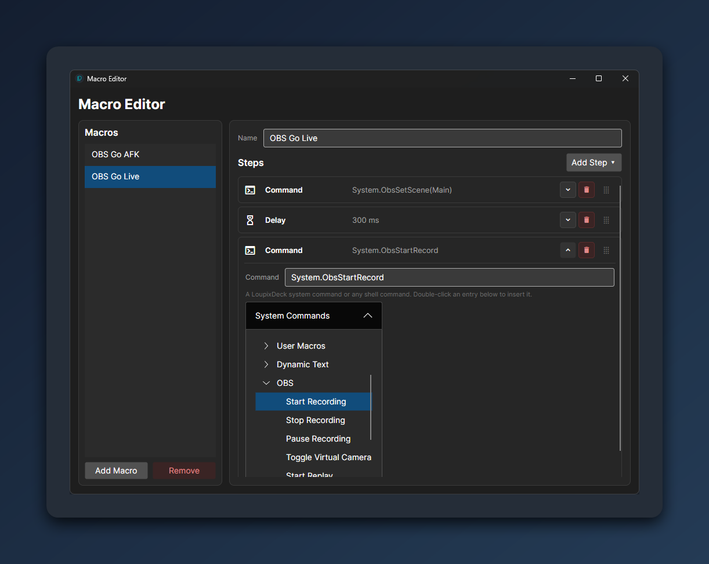

# LoupixDeck

[](https://github.com/RadiatorTwo/LoupixDeck/actions/workflows/release.yml)
[](https://github.com/RadiatorTwo/LoupixDeck)
[](https://github.com/RadiatorTwo/LoupixDeck)
[](LICENSE)

**LoupixDeck** is an open-source control deck application for **Loupedeck** devices and the **Razer Stream Controller**.

It runs on **Linux** and **Windows**, lets you build custom touch pages, rotary controls, macros, integrations and plugins, and does not depend on the official vendor software.

Built with **Avalonia** and **.NET 9**.


> New here? The [**User Manual**](docs/USER_MANUAL.md) walks through pages, buttons, layers, states, macros, integrations and automation step by step.

---

## Highlights

* **Linux and Windows support**
* **Loupedeck Live**, **Live S**, **CT** *(partial)* and **Razer Stream Controller** support
* **Multi-device support** with serial-scoped profiles
* **Layer-based touch button editor** with images, animated images, text, symbols and wallpapers
* **Stateful buttons** with multiple states and per-state actions
* **Rotary encoder pages** with rotation, click and press actions
* **Visual macro editor** with variables, conditions, loops, waits and prompts
* **OBS Studio**, **Elgato Key Lights**, **Cooler Control**, **Argus Monitor** and **Windows Audio** integrations
* **Local CLI / IPC automation** for scripts and external tools
* **Plugin SDK** for custom commands, dynamic text providers and settings UI

---

## Quick Start

Pre-built releases are available here:

[**Download latest release**](https://github.com/RadiatorTwo/LoupixDeck/releases/latest)

Release builds are self-contained. The .NET runtime is bundled and does not need to be installed separately.

### Windows

Recommended installer:

```text
LoupixDeck-Setup-win-x64.exe
```

Portable ZIP:

```text
LoupixDeck-win-x64.zip
```

For the portable build, extract the ZIP and run:

```powershell
LoupixDeck.exe
```

### Linux

Recommended installer script:

```bash
curl -fsSL https://raw.githubusercontent.com/RadiatorTwo/LoupixDeck/master/install-loupixdeck.sh | bash
```

Or with `wget`:

```bash
wget -qO- https://raw.githubusercontent.com/RadiatorTwo/LoupixDeck/master/install-loupixdeck.sh | bash
```

The installer downloads the latest release, installs LoupixDeck system-wide, adds udev rules and creates a desktop entry.

After installation, start it with:

```bash
loupixdeck
```

Or launch it from your application menu.

Prefer to inspect the installer first?

```bash
curl -fsSLO https://raw.githubusercontent.com/RadiatorTwo/LoupixDeck/master/install-loupixdeck.sh
less install-loupixdeck.sh
bash install-loupixdeck.sh
```

---

## Supported Devices

| Device                      | Status      | Layout                                                                            | VID:PID           |
| --------------------------- | ----------- | --------------------------------------------------------------------------------- | ----------------- |
| **Loupedeck Live**          | Supported   | 4×3 touch grid, 2 side touch strips, 6 rotary encoders, 8 round buttons            | `2ec2:0004`       |
| **Loupedeck Live S**        | Supported   | 5×3 touch grid, 2 rotary encoders, 8 physical buttons                             | `2ec2:0006`       |
| **Razer Stream Controller** | Supported   | 4×3 touch grid, 2 side panels, 6 rotary encoders, 8 LED buttons                   | `1532:0d06`       |
| **Loupedeck CT**            | Partial     | 4×3 touch grid, round wheel touchscreen, 6 dials, wheel, round and square buttons | `2ec2:0003/0007`  |

> Loupedeck **CT** support is still a work in progress. Some controls and behaviours are not feature-complete yet and need further hardware verification.

Multiple devices can run in parallel in a single LoupixDeck instance. Even two identical units are separated by USB serial and keep their own configuration.

---

## Features

### Touch Button Editor

Create custom touch buttons from multiple visual layers.

* Image, animated image, text and symbol layers
* Live preview with direct layer manipulation
* Per-page wallpapers with opacity control
* Optional visual touch feedback
* Content-addressed asset store for deduplicated images
* Material Design Icons symbol picker

### Stateful Buttons

Buttons can hold several named states and cycle through them on press.

* Per-state visuals and command sequences
* Local mode for simple state cycling
* External mode for states driven by plugins or live status commands

### Rotary Encoders

Rotary controls can use separate pages and separate actions for each input type.

* Rotate left / right
* Click
* Press
* Multi-command sequences per action
* Plugin command groups for assigning related rotary actions together

### Macros

LoupixDeck includes a visual macro editor for reusable automation sequences.

Supported macro actions include keyboard input, mouse input, delays, command execution, variables, conditions, loops, wait conditions and prompts.

Input injection backends:

| Platform    | Backend                      |
| ----------- | ---------------------------- |
| **Linux**   | `uinput`                     |
| **Windows** | `SendInput`                  |
| **Windows** | Optional Interception driver |

### Integrations

Built-in commands and dynamic values are available for:

* **OBS Studio** via obs-websocket
* **Elgato Key Lights** via Zeroconf discovery
* **Cooler Control**
* **Argus Monitor** on Windows
* **Windows Audio** via WASAPI
* Shell commands
* Page navigation
* Device power control
* Runtime button updates

### Screensaver

Play a full-display animated screensaver after a configurable idle time.

* GIF or MP4 source
* Adjustable idle timeout
* Wakes on the next touch or control interaction

### App-Focus Page Switching

Automatically switch pages when the foreground application changes.

Rules can match a process name, an optional window title substring and a fallback page.

| Platform                 | Status                                  |
| ------------------------ | --------------------------------------- |
| **Windows**              | Supported                               |
| **Linux X11 / XWayland** | Supported via `xprop`                   |
| **Pure Wayland**         | Not supported, no common focus protocol |

### Native Haptic Feedback

Supported touch buttons can use native vibration effects.

Native haptic support is based on reverse-engineered firmware commands. Technical notes are available in [docs/NATIVE_HAPTIC.md](docs/NATIVE_HAPTIC.md).

Huge thanks to [@Athorus](https://github.com/Athorus) for the reverse-engineering work that made this possible.

### Multi-Device Support

LoupixDeck can drive multiple connected devices at the same time.

* Each device gets its own profile
* Identical devices are separated by USB serial
* Devices can be connected or disconnected while LoupixDeck is running
* A device switcher appears when more than one device is connected
* CLI commands can target a specific device

---

## Screenshots

| Loupedeck Live S                                                              | Razer Stream Controller                                                          |
| ----------------------------------------------------------------------------- | -------------------------------------------------------------------------------- |
|  |  |

| Layer Editor                                                          | Symbol Picker                                                              |
| --------------------------------------------------------------------- | -------------------------------------------------------------------------- |
|  |  |

| Settings                                                              | Macro Editor                                              |
| --------------------------------------------------------------------- | --------------------------------------------------------- |
|  |  |

---

## Plugins

LoupixDeck supports third-party plugins.

Plugins can provide:

* custom commands
* dynamic text providers
* settings UI
* integration-specific functionality

The Plugin SDK is maintained in a separate repository:

[**LoupixDeck.PluginSdk**](https://github.com/RadiatorTwo/LoupixDeck.PluginSdk)

It is also available as the `LoupixDeck.PluginSdk` NuGet package.

---

## CLI / Automation

While LoupixDeck is running, external scripts can control it through a local IPC channel.

The easiest way is to call the LoupixDeck binary again. If an instance is already running, the second process forwards the command and exits.

### Examples

Linux:

```bash
./LoupixDeck nextpage
./LoupixDeck page 3
./LoupixDeck updatebutton 6 text=Build_OK backColor=LimeGreen
./LoupixDeck System.ObsStartRecord
```

Windows:

```powershell
.\LoupixDeck.exe nextpage
.\LoupixDeck.exe page 3
.\LoupixDeck.exe updatebutton 6 text=Build_OK backColor=LimeGreen
```

Target a specific device:

```bash
./LoupixDeck --device A1B2C3 page 3
./LoupixDeck -d "Loupedeck Live S" nextpage
```

IPC endpoints:

| Platform    | Endpoint                                      |
| ----------- | --------------------------------------------- |
| **Linux**   | Unix domain socket `/tmp/loupixdeck_app.sock` |
| **Windows** | Named pipe `LoupixDeck_Pipe`                  |

---

## Configuration

LoupixDeck auto-detects supported devices by USB VID/PID.

Configuration is stored as JSON in the user config directory.

Typical files:

| File                   | Purpose                               |
| ---------------------- | ------------------------------------- |
| `config.json`          | Global application settings           |
| `config_<device>.json` | Per-device layout and device settings |
| `obs.json`             | OBS integration settings              |
| `elgato.json`          | Elgato integration settings           |
| `macros.json`          | Shared macro definitions              |

Per-device configuration is scoped by USB serial whenever possible, so two identical devices do not overwrite each other's layouts.

If a configuration file becomes corrupted, LoupixDeck creates a backup before writing a fresh file.

---

## Documentation

* [User Manual](docs/USER_MANUAL.md) — complete feature documentation
* [Native Haptic Notes](docs/NATIVE_HAPTIC.md) — reverse-engineered haptic commands
* [Plugin SDK](https://github.com/RadiatorTwo/LoupixDeck.PluginSdk) — build custom plugins
* [Latest Releases](https://github.com/RadiatorTwo/LoupixDeck/releases/latest) — download pre-built binaries

---

## Build from Source

Requires the [.NET 9 SDK](https://dotnet.microsoft.com/download).

### Linux

```bash
git clone https://github.com/RadiatorTwo/LoupixDeck.git
cd LoupixDeck

dotnet publish LoupixDeck.csproj -c Release -r linux-x64 --self-contained true \
  /p:PublishSingleFile=true \
  /p:PublishTrimmed=false \
  /p:EnableCompressionInSingleFile=true \
  /p:ReadyToRun=true \
  -o publish/linux-x64
```

### Windows

```powershell
git clone https://github.com/RadiatorTwo/LoupixDeck.git
cd LoupixDeck

dotnet publish LoupixDeck.csproj -c Release -r win-x64 --self-contained true `
  /p:PublishSingleFile=true `
  /p:PublishTrimmed=false `
  /p:EnableCompressionInSingleFile=true `
  /p:ReadyToRun=true `
  -o publish/win-x64
```

<details>
<summary>Linux device and macro permissions</summary>

On Linux, macro **execution** writes to `/dev/uinput` and macro **recording** reads `/dev/input/event*`.

The bundled `install-loupixdeck.sh` already writes the uinput rule and adds the invoking user to the `input` group. Being able to run macros does **not** automatically mean recording works — recording additionally needs read access to `/dev/input/event*`, which the `input` group provides.

Manual uinput rule:

```text
KERNEL=="uinput", SUBSYSTEM=="misc", GROUP="input", MODE="0660", OPTIONS+="static_node=uinput"
```

Add your user to the `input` group:

```bash
sudo usermod -aG input "$USER"
```

Then log out and back in.

If the device itself is not accessible without `sudo`, add a udev rule for its VID/PID.

Example for the Loupedeck Live S:

```text
SUBSYSTEM=="usb", ATTRS{idVendor}=="2ec2", ATTRS{idProduct}=="0006", MODE="0666"
SUBSYSTEM=="tty", ATTRS{idVendor}=="2ec2", ATTRS{idProduct}=="0006", MODE="0666"
```

For the Razer Stream Controller, replace `2ec2:0006` with `1532:0d06`.

Reload rules and reconnect the device:

```bash
sudo udevadm control --reload-rules
sudo udevadm trigger
```

</details>

---

## Diagnostics

Managed crash logging can be enabled with:

```bash
./LoupixDeck --crashlog
```

On Windows:

```powershell
.\LoupixDeck.exe --crashlog
```

For very noisy first-chance exception logging:

```bash
./LoupixDeck --firstchance
```

Crash logs are written to the LoupixDeck user config directory.

Native crashes are not captured by `--crashlog`. For native crashes, use the .NET minidump environment variables instead.

---

## Third-Party Software

### Interception Driver on Windows

The optional Windows macro driver feature can use the [Interception](https://github.com/oblitum/Interception) kernel driver to inject keyboard and mouse input at driver level.

This can be useful for applications that read raw input.

Important notes:

* The Interception driver is **not bundled** with LoupixDeck.
* It is only downloaded when installing it from the settings.
* Interception is free for non-commercial use only.
* Commercial use requires a separate license from its author.
* Without Interception, macros use the standard Windows `SendInput` backend.

---

## Project Status

LoupixDeck is usable for daily use and actively developed.

Most core features are available for Loupedeck Live, Loupedeck Live S and Razer Stream Controller. Loupedeck CT support is still incomplete and depends on further hardware testing.

Bug reports, testing feedback and pull requests are welcome.

---

## License

LoupixDeck is released under the [MIT License](LICENSE).

Third-party components are subject to their own licenses.
