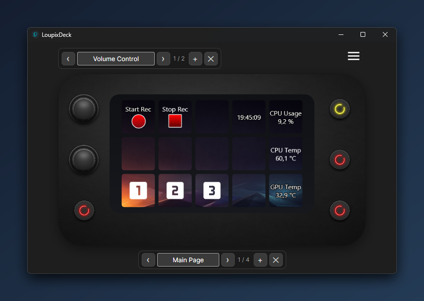
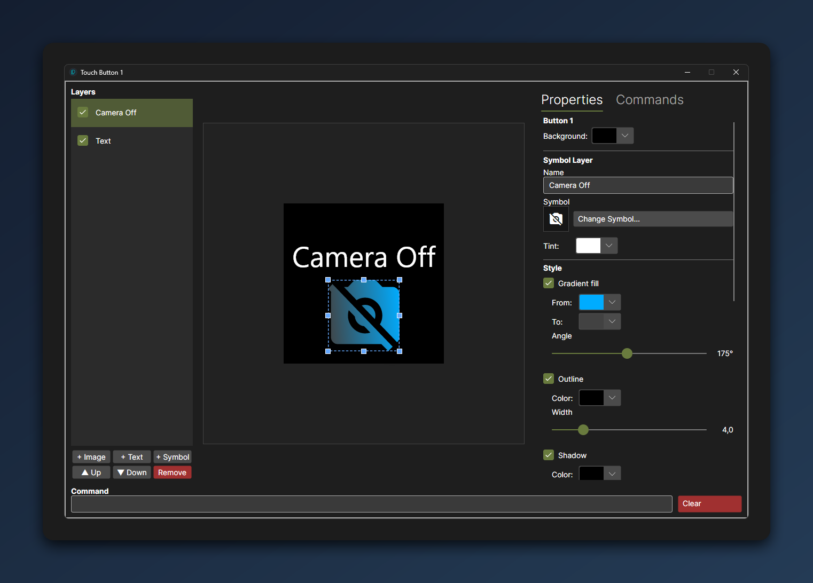
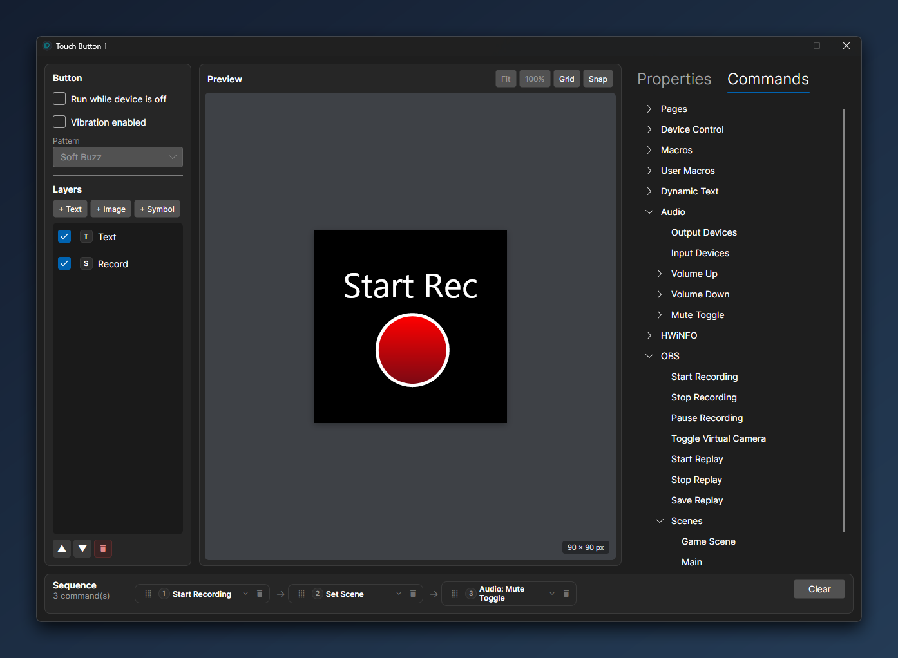
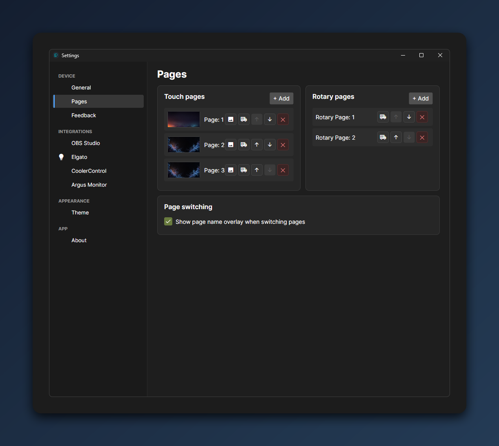
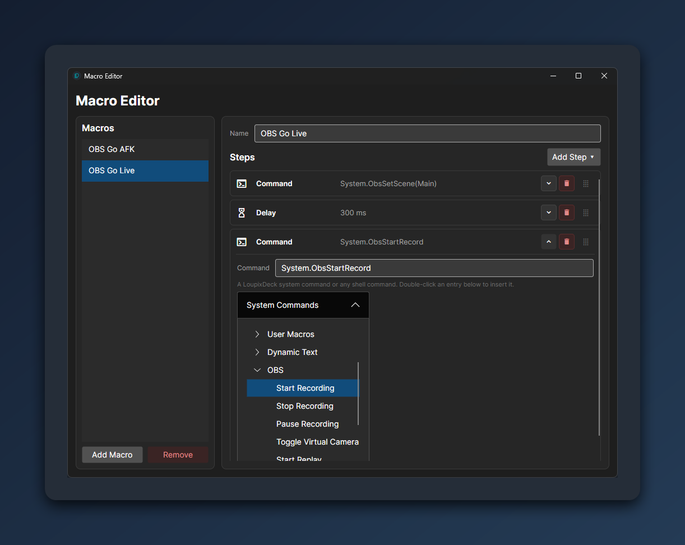
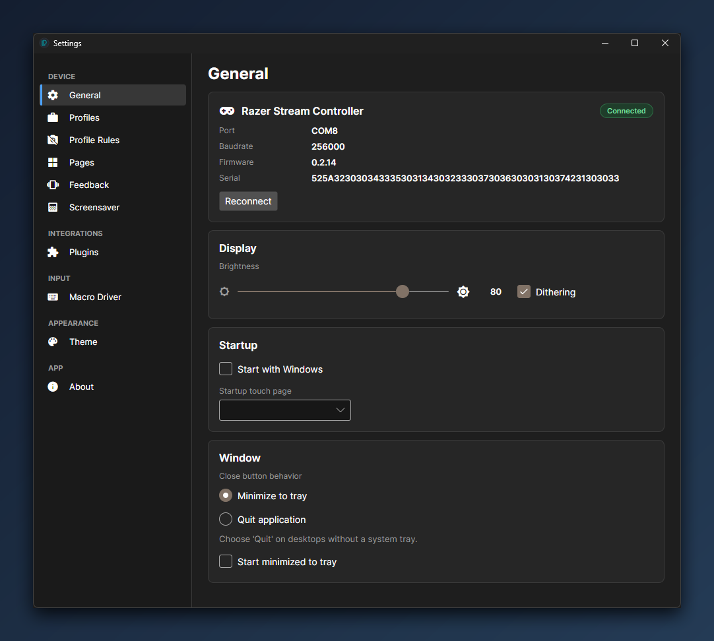
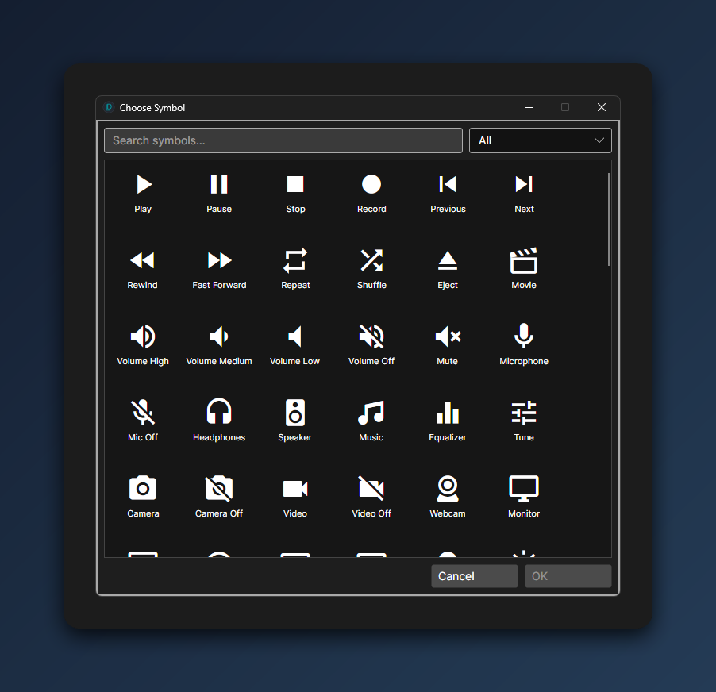

# LoupixDeck

[](https://github.com/RadiatorTwo/LoupixDeck/actions/workflows/release.yml)
[](https://github.com/RadiatorTwo/LoupixDeck/releases/latest)
[](https://github.com/RadiatorTwo/LoupixDeck/releases/latest)
[](LICENSE)

**An open-source control deck application for Loupedeck and Razer Stream Controller devices.**

Create custom touch pages, rotary controls, folders, macros and application-aware layouts on **Windows and Linux**—without the official vendor software.

Built with [Avalonia](https://avaloniaui.net/) and [.NET 10](https://dotnet.microsoft.com/).



[**Download latest release**](https://github.com/RadiatorTwo/LoupixDeck/releases/latest) · [**Read the user manual**](docs/USER_MANUAL.md) · [**Report a bug**](https://github.com/RadiatorTwo/LoupixDeck/issues/new) · [**Plugin SDK**](https://github.com/RadiatorTwo/LoupixDeck.PluginSdk)

---

## Why LoupixDeck?

- **Cross-platform:** native support for Windows and Linux, including SteamOS
- **Your layout, your way:** profiles, workspaces, pages, nested folders and per-page wallpapers
- **Powerful controls:** layered buttons, multiple states, rotary actions, macros and app-focus switching
- **Multiple devices:** use several supported controllers at the same time, even identical models
- **Extensible:** install integrations from the built-in Plugin Store or create your own
- **Portable:** export and share profiles, workspaces or individual pages as `.loupixprofile` packages
- **Multilingual:** English, German and Spanish interfaces

## Supported devices

| Device | Status | Controls |
| --- | :---: | --- |
| **Loupedeck Live** | ✅ Supported | 4×3 touch grid, 2 touch strips, 6 dials, 8 round buttons |
| **Loupedeck Live S** | ✅ Supported | 5×3 touch grid, 2 dials, 8 physical buttons |
| **Razer Stream Controller** | ✅ Supported | 4×3 touch grid, 2 side panels, 6 dials, 8 LED buttons |
| **Razer Stream Controller X** | ✅ Supported | 5×3 physical key grid |
| **Loupedeck CT** | 🚧 Partial | 4×3 touch grid, wheel display, 6 dials and additional buttons |

Loupedeck CT support is still being completed and needs more hardware testing. The Stream Controller X has physical keys instead of a touchscreen; LoupixDeck maps each key to the corresponding display position and supports press-and-hold actions.

Multiple devices can run in one LoupixDeck instance. Devices are separated by USB serial number and retain their own configuration.

## Install

Release builds are self-contained—the .NET runtime is included.

### Windows

Download the latest release and choose one of these packages:

| Package | Recommended for |
| --- | --- |
| `LoupixDeck-Setup-win-x64.exe` | Normal installation |
| `LoupixDeck-win-x64.zip` | Portable use |

For the portable version, extract the archive and run `LoupixDeck.exe`.

[**Download for Windows**](https://github.com/RadiatorTwo/LoupixDeck/releases/latest)

### Linux

Run the installer as your normal user—do **not** prefix the command with `sudo`:

```bash
curl -fsSL https://github.com/RadiatorTwo/LoupixDeck/releases/latest/download/install-loupixdeck.sh | bash
```

The installer downloads the latest release, installs LoupixDeck, configures the required device permissions and creates an application-menu entry. Start it from your application menu or run:

```bash
loupixdeck
```

<details>
<summary>Inspect the installer before running it</summary>

```bash
curl -fsSLO https://github.com/RadiatorTwo/LoupixDeck/releases/latest/download/install-loupixdeck.sh
less install-loupixdeck.sh
bash install-loupixdeck.sh
```

</details>

<details>
<summary>Install the current master branch</summary>

This requires Git and the .NET 10 SDK:

```bash
bash install-loupixdeck.sh --from-source
```

Add `--restart` to close a running instance before installation and launch it again afterwards.

</details>

#### SteamOS

Use the same command in **Konsole while in Desktop Mode**. The installer automatically uses a SteamOS-compatible installation inside your home directory and registers the device-permission rule so it survives system updates.

Only the device-permission step needs administrator rights. If you have never configured a SteamOS password, run `passwd` first.

> A Flatpak is not provided because sandboxing blocks hardware access, input simulation, application launching and functionality required by many plugins.

## First steps

1. Connect a supported device and start LoupixDeck.
2. Open the **Apps and Commands** panel from the top-left corner.
3. Drag an application or command onto a button—or select a control and double-click the item.
4. Select a button to customize its image, text, symbol, actions and states.
5. Add profiles, workspaces, pages and folders as your setup grows.
6. Open **Plugins** from the hamburger menu, then choose **Plugin Store** to install integrations.

For a complete walkthrough, see the [User Manual](docs/USER_MANUAL.md).

## What you can build

### Buttons and visual layouts

- Combine image, animated image, text and symbol layers
- Move and edit layers with a live preview
- Add outlines, colors, transparency and Material Design Icons
- Use per-page wallpapers and optional touch feedback
- Give a button several named states with separate visuals and actions

### Pages and folders

- Organize layouts as **Profile → Workspace → Page**
- Create nested custom folders in the **Folders** panel and drag them onto touch keys
- Navigate with breadcrumbs in the application and an automatic Back button on the device
- Use plugin-provided dynamic folders for live content such as audio sessions or OBS scenes

### Rotary controls

- Assign separate actions to rotate left, rotate right, click and press
- Run multi-command sequences from any gesture
- Apply built-in, plugin-provided or user-created dial presets, grouped by source
- Assign related plugin actions as a group
- Use independent rotary pages where supported

### Macros and direct input

The visual macro editor supports keyboard and mouse input, delays, commands, variables, conditions, loops, wait conditions and prompts.

For simpler actions, buttons and dials can directly send mouse clicks, scrolling, keyboard/mouse chords, key combinations and multi-step key sequences.

| Platform | Input backend |
| --- | --- |
| Linux | `uinput` |
| Windows | `SendInput` |
| Windows | Optional Interception driver for raw-input applications |

### Application-aware layouts

LoupixDeck can automatically switch pages when the foreground application changes. Rules can match the process name and, optionally, part of the window title.

| Platform | Status |
| --- | --- |
| Windows | ✅ Supported |
| Linux X11 / XWayland | ✅ Supported via `xprop` |
| Pure Wayland | ❌ Not available—there is no common foreground-window protocol |

### Integrations

Built-in commands and plugins cover:

- OBS Studio via obs-websocket
- Elgato Key Lights
- Audio devices, per-application mixing and sound playback on Windows and Linux
- SteelSeries Sonar on Windows
- Cooler Control and Linux hardware information
- Argus Monitor on Windows
- Shell commands, page navigation and device power
- Runtime text, color and button-state updates

### More features

- **Multi-device support:** hot-plug devices and target them individually
- **Companion devices:** let companions mirror a master's profiles, workspaces and folders while keeping their own pages
- **Portable profiles:** export and import profiles, workspaces or pages
- **Screensavers:** use a video, GIF or plugin-provided renderer
- **Native haptics:** configure vibration effects on supported touch controls
- **CLI automation:** control a running instance from scripts and external tools
- **Automatic recovery:** corrupted configuration files are backed up before replacement

## Screenshots

| Layer editor | Command picker |
| --- | --- |
|  |  |

| Page management | Macro editor |
| --- | --- |
|  |  |

| Settings | Symbol picker |
| --- | --- |
|  |  |

## Plugins

Plugins can add commands, live text, settings pages, integrations, screensavers, dynamic folders and animated side strips.

Open the separate **Plugins** window from the hamburger menu. Its searchable installed list shows status and version, lets you choose the device being configured, and keeps plugin settings available even when no deck is connected. Enabling remains an explicit per-device action.

The **Plugin Store** page uses a searchable tile grid and one catalogue request to check published versions. You can read release notes on demand, install, update, remove or adopt a hand-copied plugin, cancel a download, and restart when a staged change needs it. Downloads are checked against their published checksums, while settings and missing command assignments survive updates or temporary removal.

Want to create a plugin?

- [Plugin SDK repository](https://github.com/RadiatorTwo/LoupixDeck.PluginSdk)
- [`LoupixDeck.PluginSdk` on NuGet](https://www.nuget.org/packages/LoupixDeck.PluginSdk) Coming soon
- [Plugin SDK documentation](https://github.com/RadiatorTwo/LoupixDeck.PluginSdk/wiki)

## Portable profiles

Export a complete profile, a workspace or a single page from **Settings → Profiles** or **Settings → Pages**; profile and workspace exports plus **Import Package…** are also available from the main-window header menus. Profile and workspace packages include their custom folders and, optionally, the pages of a master's companions.

Before importing, LoupixDeck shows missing plugins and commands, device compatibility warnings and macro-name conflicts. You can add the package as a copy or replace an existing item; replacement can automatically create a backup first.

The `.loupixprofile` format is a regular ZIP archive containing only the required configuration, macros and assets.

## CLI and automation

Start the LoupixDeck executable again while the application is running to send it a command:

```bash
# Linux
./LoupixDeck nextpage
./LoupixDeck page 3
./LoupixDeck updatebutton 6 text=Build_OK backColor=LimeGreen
./LoupixDeck System.ObsStartRecord

# Target a specific device by serial number or name
./LoupixDeck --device A1B2C3 page 3
./LoupixDeck -d "Loupedeck Live S" nextpage
```

```powershell
# Windows
.\LoupixDeck.exe nextpage
.\LoupixDeck.exe page 3
.\LoupixDeck.exe updatebutton 6 text=Build_OK backColor=LimeGreen
```

| Platform | IPC endpoint |
| --- | --- |
| Linux | Unix domain socket `/tmp/loupixdeck_app.sock` |
| Windows | Named pipe `LoupixDeck_Pipe` |

## Build from source

Install the [.NET 10 SDK](https://dotnet.microsoft.com/download), then clone the repository:

```bash
git clone https://github.com/RadiatorTwo/LoupixDeck.git
cd LoupixDeck
```

### Linux

```bash
dotnet publish LoupixDeck.csproj -c Release -r linux-x64 --self-contained true \
  /p:PublishSingleFile=true \
  /p:PublishTrimmed=false \
  /p:EnableCompressionInSingleFile=true \
  /p:ReadyToRun=true \
  -o publish/linux-x64
```

### Windows

```powershell
dotnet publish LoupixDeck.csproj -c Release -r win-x64 --self-contained true `
  /p:PublishSingleFile=true `
  /p:PublishTrimmed=false `
  /p:EnableCompressionInSingleFile=true `
  /p:ReadyToRun=true `
  -o publish/win-x64
```

<details>
<summary>Manual Linux device and macro permissions</summary>

The installer configures these permissions automatically. For a manual source installation, macro execution needs write access to `/dev/uinput`, and macro recording needs read access to `/dev/input/event*`.

Create a uinput rule:

```text
KERNEL=="uinput", SUBSYSTEM=="misc", GROUP="input", MODE="0660", OPTIONS+="static_node=uinput"
```

Add your user to the `input` group, then log out and back in:

```bash
sudo usermod -aG input "$USER"
```

If the device itself is inaccessible, add rules for its VID/PID:

| Device | VID:PID |
| --- | --- |
| Loupedeck Live | `2ec2:0004` |
| Loupedeck Live S | `2ec2:0006` |
| Loupedeck CT | `2ec2:0003` / `2ec2:0007` |
| Razer Stream Controller | `1532:0d06` |
| Razer Stream Controller X | `1532:0d09` |

Example for Loupedeck Live S:

```text
SUBSYSTEM=="usb", ATTRS{idVendor}=="2ec2", ATTRS{idProduct}=="0006", MODE="0666"
SUBSYSTEM=="tty", ATTRS{idVendor}=="2ec2", ATTRS{idProduct}=="0006", MODE="0666"
```

The Stream Controller X also needs access to its HID interface:

```text
SUBSYSTEM=="hidraw", ATTRS{idVendor}=="1532", ATTRS{idProduct}=="0d09", MODE="0666"
```

Reload the rules and reconnect the device:

```bash
sudo udevadm control --reload-rules
sudo udevadm trigger
```

</details>

## Troubleshooting

Enable managed crash logging:

```bash
./LoupixDeck --crashlog
```

Logs are written to the LoupixDeck user configuration directory. For very noisy first-chance exception logging, use `--firstchance`. Native crashes require the .NET minidump environment variables instead.

For setup and usage help, check the [User Manual](docs/USER_MANUAL.md) or [open an issue](https://github.com/RadiatorTwo/LoupixDeck/issues/new).

<details>
<summary>Optional Interception driver on Windows</summary>

The optional [Interception](https://github.com/oblitum/Interception) driver can inject keyboard and mouse input at driver level for applications that read raw input.

- It is not bundled with LoupixDeck.
- It is downloaded only when installed from Settings.
- It is free for non-commercial use; commercial use requires a separate license from its author.
- Without it, macros use the standard Windows `SendInput` backend.

</details>

## Contributing

Bug reports, hardware testing, translations, documentation improvements and pull requests are welcome.

Please read [CONTRIBUTING.md](CONTRIBUTING.md) before submitting a change. If you are unsure whether an idea fits the project, open an issue first.

## Project status

LoupixDeck is actively developed and suitable for daily use on the fully supported devices listed above. Loupedeck CT support remains experimental while its remaining controls are implemented and verified.

## License

LoupixDeck is available under the [MIT License](LICENSE). Third-party components remain subject to their own licenses.
